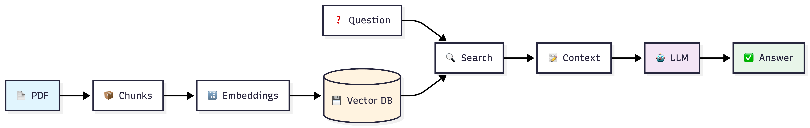

# RAG Application - Nepal Constitution Q&A 

A Retrieval-Augmented Generation (RAG) application that enables intelligent question-answering on Nepal's Constitution using LangChain, HuggingFace models, and ChromaDB vector database.

## Overview

This project implements a complete RAG pipeline that processes the PDF document, creates searchable embeddings, and uses a Large Language Model to answer user questions based on the retrieved context. The system combines document retrieval with generative AI to provide accurate, context-based responses.

## System Architecture



The system follows a two-phase architecture:

1. **Indexing Pipeline**: PDF → Chunks → Embeddings → Vector Database
2. **Query Pipeline**: Question → Retrieve → Context + Prompt → LLM → Answer

## Technologies Used

| Component | Technology |
|-----------|------------|
| Framework | LangChain |
| Embeddings | sentence-transformers/all-MiniLM-L6-v2 |
| LLM | TinyLlama-1.1B-Chat |
| Vector Database | ChromaDB |

## Project Structure

```bash
RAG_APPLICATION/
│
├── data/
│   ├── documents/
│   │   └── Constitution_of_Nepal.pdf    # Source document
│   └── chroma_db/                       # Persisted vector store
│
├── config.py              # Configuration settings and paths
├── indexing.py            # Document processing and embedding pipeline
├── retrieval.py           # RAG chain creation and query handling
├── main.py                # Entry point and interactive interface
├── utils.py               # Utility functions
├── test.py                # Testing utilities
├── requirements.txt       # Python dependencies
└── README.md              # This file
```

## Configuration
Update settings in `config.py`:
#### Model Settings
```python
EMBEDDING_MODEL = "sentence-transformers/all-MiniLM-L6-v2"
LLM_MODEL = "TinyLlama/TinyLlama-1.1B-Chat-v1.0"
```


#### Chunking Parameters
```python
CHUNK_SIZE = 400
CHUNK_OVERLAP = 50
```

#### Retrieval Settings
```python
TOP_K = 2                           # Number of documents to retrieve
COLLECTION_NAME = "nepal_constitution" #Custom collection name for your local pdf data
```
#### Document Settings
```python
# Change this to your PDF filename
PDF_PATH = os.path.join(DOCUMENTS_DIR, "Constitution_of_Nepal.pdf")
```
Note: If using a different PDF, update the filename in config.py

## Usage

### Running the Application
```bash
python main.py
```

## Sample Output

```bash
============================================================
 RETRIEVAL PIPELINE READY
============================================================

============================================================
 INTERACTIVE MODE
============================================================
Enter your questions about Nepal's Constitution (type 'quit' to exit)

Your question: What is the structure of the federal government?

Answer: The federal government is made up of three levels: the Federation, 
the State, and the Local level. The main structure of the Federal Democratic 
Republic of Nepal is of three levels, namely the Federation, the State, and 
the Local Level.

Your question: Minimum age for marriage in Nepal

Answer: The minimum age for marriage in Nepal is 18 years.

Your question: quit
Exiting...
```